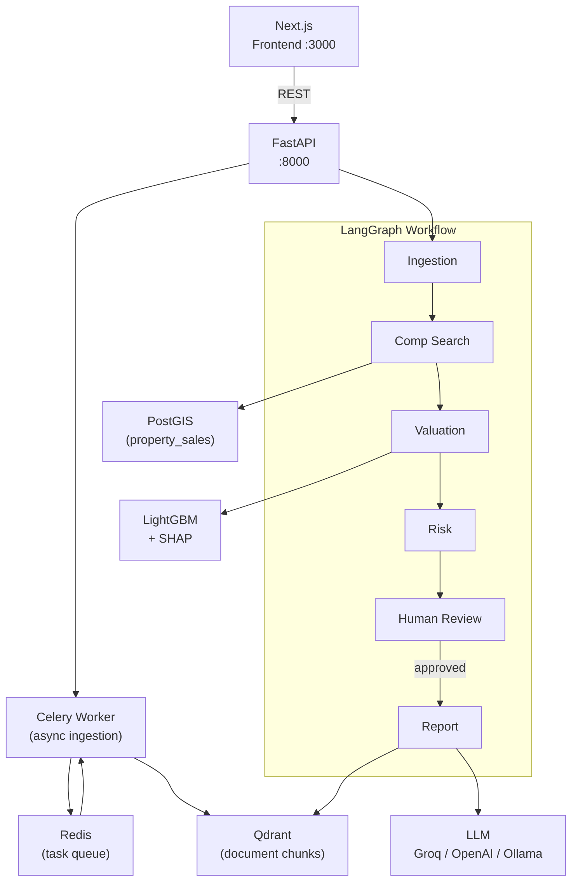
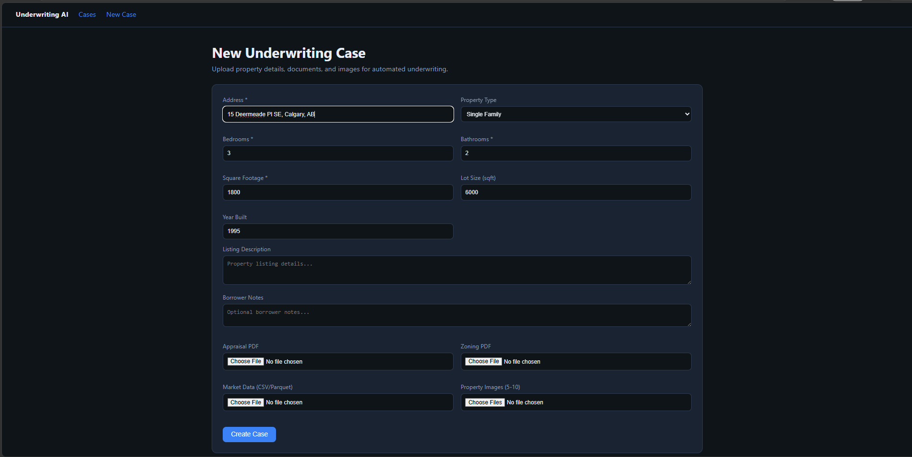
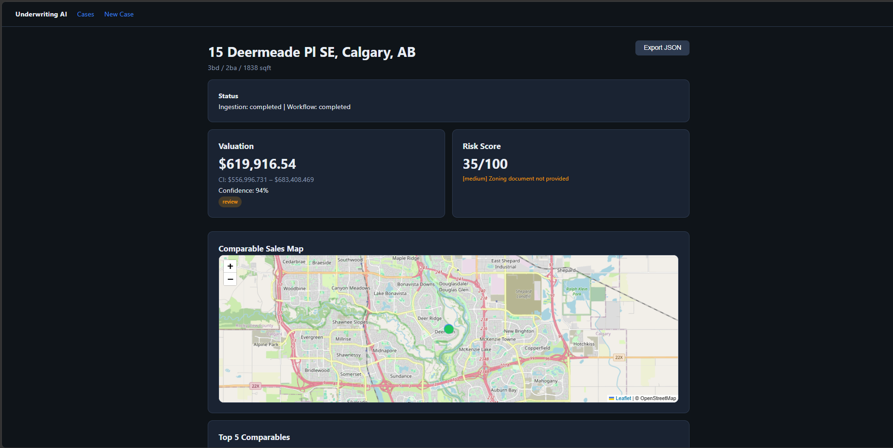
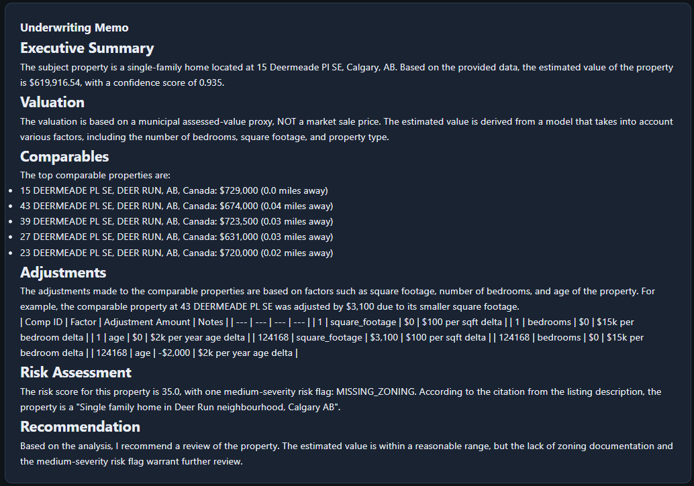

# UnderwriteAI — Agentic Real Estate Underwriting

A production-style AI system that ingests property listings, market data, and documents to produce lender-style underwriting reports with comparable sales, ML valuation, risk flags, SHAP explainability, and cited reasoning.

---

## Why This Project Matters

Real estate underwriting is manually intensive and judgment-heavy. This project demonstrates how an **agentic AI pipeline** can automate the full workflow end-to-end:

| Capability | Implementation |
|---|---|
| Agentic workflow with human-in-the-loop | LangGraph 6-node graph, interrupt/resume |
| ML-based property valuation | LightGBM + SHAP feature attribution |
| Geospatial comparable search | PostGIS + haversine distance ranking |
| Hybrid document retrieval (RAG) | Qdrant vector store + cross-encoder reranker |
| LLM report generation | Groq / OpenAI / Ollama (configurable) |
| Async document ingestion | Celery + Redis worker queue |
| Observability | OpenTelemetry tracing, Ragas/DeepEval eval stubs |
| Dockerized full stack | Postgres, Qdrant, Redis, API, Worker, Next.js |

This is not a toy demo. Every service runs in Docker, data flows through a real geospatial database, and the ML model is trained on 156 k real municipal assessment records.

---

## Architecture



---

## Demo Quickstart

### Prerequisites

- Docker & Docker Compose
- A free [Groq API key](https://console.groq.com) (or OpenAI key — see LLM options below)
- Calgary open-data CSV in `data/calgary.csv` — download from [Calgary Open Data](https://data.calgary.ca/Government/Current-Year-Property-Assessments-Parcel-/4bsw-nn7w) (Export → CSV)

### 1. Clone and configure

```bash
git clone https://github.com/vanshpatel20022002/underwrite-ai.git
cd underwrite-ai
cp .env.example .env
```

Open `.env` and set your Groq key:

```ini
LLM_PROVIDER=groq
GROQ_API_KEY=gsk_your_key_here
```

### 2. Start all services

```bash
docker compose -f docker/docker-compose.yml up --build -d
docker compose -f docker/docker-compose.yml ps   # all should be healthy
```

Services: Postgres (PostGIS) · Qdrant · Redis · FastAPI · Celery worker · Next.js

### 3. Seed property data and train the model

```bash
docker compose -f docker/docker-compose.yml exec api python scripts/seed_data.py
```

Expected output (takes ~3 min for 156 k rows):

```
[1/4] Loading Calgary residential assessments (all rows, no limit)...
  Calgary: 170,000 raw -> 161,610 residential -> 156,755 in value range -> 156,755 to process
[2/4] Saved training CSV: /app/data/property_sales.csv  (156,755 rows)
[3/4] Training LightGBM model...
  MAE:  $45,284
  RMSE: $80,359
  MAPE: 6.61%
  Train size: 125,404 rows
[4/4] Seeding PostGIS (156,755 rows)...
Done! Use Calgary, AB addresses for demo cases.
```

### 4. Create a sample underwriting case

```bash
curl -s -X POST http://localhost:8000/api/v1/cases \
  -F "address=15 Deermeade Pl SE, Calgary, AB" \
  -F "property_type=single_family" \
  -F "bedrooms=3" \
  -F "bathrooms=2" \
  -F "square_footage=1838" \
  -F "lot_size=6567" \
  -F "year_built=1981" | python3 -m json.tool
```

Note the `"id"` field in the response.

### 5. Run the underwriting workflow

```bash
# Replace <CASE_ID> with the id from step 4
curl -X POST http://localhost:8000/api/v1/workflow/<CASE_ID>/run
# → {"workflow_status": "awaiting_human_review", ...}

# Approve the human-review checkpoint
curl -X POST "http://localhost:8000/api/v1/workflow/<CASE_ID>/resume?approved=true"
```

### 6. Open the interfaces

| Interface | URL |
|---|---|
| Interactive API docs | http://localhost:8000/docs |
| Next.js frontend | http://localhost:3000 |
| Qdrant dashboard | http://localhost:6333/dashboard |

---

## Sample Output

Verified result for **15 Deermeade Pl SE, Calgary, AB** (3 bed / 2 bath / 1,838 sqft / built 1981):

```json
{
  "estimated_value": 619916.54,
  "confidence_interval": { "low": 556997, "high": 683408, "level": 0.8 },
  "confidence_score": 0.935,
  "risk_score": 35.0,
  "recommendation": "review",
  "top_5_comps": [
    { "address": "15 DEERMEADE PL SE, DEER RUN", "sale_price": 729000, "distance_miles": 0.00 },
    { "address": "43 DEERMEADE PL SE, DEER RUN", "sale_price": 674000, "distance_miles": 0.04 },
    { "address": "39 DEERMEADE PL SE, DEER RUN", "sale_price": 723500, "distance_miles": 0.03 },
    { "address": "27 DEERMEADE PL SE, DEER RUN", "sale_price": 631000, "distance_miles": 0.03 },
    { "address": "23 DEERMEADE PL SE, DEER RUN", "sale_price": 720000, "distance_miles": 0.02 }
  ],
  "shap_features": [
    { "feature": "bedrooms",           "contribution": -26304 },
    { "feature": "sale_recency_days",  "contribution": -25829 },
    { "feature": "longitude",          "contribution": -13352 },
    { "feature": "property_type_code", "contribution": +12705 },
    { "feature": "square_footage",     "contribution": +12300 }
  ],
  "risk_flags": [
    { "code": "MISSING_ZONING", "severity": "medium", "message": "Zoning document not provided" }
  ]
}
```

**Generated memo excerpt (Groq `llama-3.3-70b-versatile`):**

> **Valuation** — The estimated value is $619,917 CAD. Value is based on municipal assessed-value proxy, NOT a market sale price. The estimate is derived from a LightGBM model trained on 125,404 Calgary residential assessment records.
>
> **Comparables** — Five comparables found within 0.04 miles, all on the same street. Assessed proxies range from $631,000 to $729,000.
>
> **Risk Assessment** — Risk score 35/100. One medium flag: zoning document not uploaded. Recommend providing zoning confirmation before final approval.
>
> **Recommendation** — `review`

---
## Demo Screenshots

### Create underwriting case



### Valuation, risk score, and comparable sales map



### Generated underwriting memo


---
## Data Disclosure

**This project uses Calgary municipal property assessment data, not real estate transaction data.**

| Fact | Detail |
|---|---|
| Data source | [Calgary Open Data — Current Year Property Assessments](https://data.calgary.ca/Government/Current-Year-Property-Assessments-Parcel-/4bsw-nn7w) |
| Price field | `ASSESSED_VALUE` — the City of Calgary's annual assessed value, **not** a recorded sale price |
| Stored as | `sale_price` column in the database schema (legacy column name); labeled as proxy in all reports |
| Bedrooms / bathrooms / sqft | Estimated from assessed value and lot size heuristics — **not sourced from MLS or transaction records** |
| Geographic coordinates | Derived from MULTIPOLYGON centroid in the assessment roll |
| Training coverage | 156,755 residential records in Calgary, AB only |
| Other datasets | Vancouver open data and StatCan/CMHC files are present in `data/` but **not used** in v1 model training |
| Model accuracy | MAE ≈ $45,284 · RMSE ≈ $80,359 · MAPE ≈ 6.61% (train/test split on assessed values) |

All generated reports include the disclaimer: *"Value is based on municipal assessed-value proxy, NOT a market sale price."*

---

## LLM Options

Set `LLM_PROVIDER` in `.env` to one of:

| Provider | env vars required | Notes |
|---|---|---|
| `groq` (default) | `GROQ_API_KEY` | Free tier, fast. Uses `llama-3.3-70b-versatile` |
| `openai` | `OPENAI_API_KEY` | Uses `gpt-4.1-mini` |
| `ollama` | `OLLAMA_BASE_URL` | Local inference, no key required |
| `vertex` | `GOOGLE_APPLICATION_CREDENTIALS`, `VERTEX_PROJECT_ID` | GCP Gemini |

---

## API Reference

### Create case (multipart form)

```bash
POST /api/v1/cases
Fields: address*, bedrooms*, bathrooms*, square_footage*,
        property_type, lot_size, year_built, listing_description,
        appraisal_pdf, zoning_pdf, images[]
```

### Run workflow

```bash
POST /api/v1/workflow/{case_id}/run
POST /api/v1/workflow/{case_id}/resume?approved=true|false
GET  /api/v1/workflow/{case_id}/stream   # SSE
```

### List / get cases

```bash
GET /api/v1/cases
GET /api/v1/cases/{case_id}
```

Full interactive docs: **http://localhost:8000/docs**

---

## Project Structure

```
├── backend/
│   ├── app/
│   │   ├── agents/       # LangGraph nodes (graph.py, report.py, risk.py)
│   │   ├── api/          # FastAPI routes (cases, workflow, eval)
│   │   ├── ingestion/    # CSV loaders, PDF parser, Celery pipeline
│   │   ├── ml/           # LightGBM train / predict / ranker / SHAP
│   │   ├── geo/          # PostGIS comp search, geocoder
│   │   ├── retrieval/    # Qdrant store, embeddings, reranker
│   │   ├── llm/          # Provider abstraction (Groq/OpenAI/Ollama/Vertex)
│   │   └── eval/         # Ragas, DeepEval, DSPy stubs
│   ├── models/           # Trained model artifacts (gitignored)
│   ├── scripts/          # seed_data.py
│   └── tests/            # pytest suite (10 tests)
├── frontend/             # Next.js 15 / React 19 dashboard
├── docker/               # Dockerfile.api, Dockerfile.frontend, docker-compose.yml
├── data/                 # Raw CSVs (gitignored except samples)
└── .env.example          # Environment template
```

---

## Running Tests

```bash
docker compose -f docker/docker-compose.yml exec api pytest tests/ -v
```

```
10 passed in 12s
```

---

## Canadian Data Sources

| File | Source | Used in v1 |
|---|---|---|
| `data/calgary.csv` | [Calgary Open Data – Property Assessments](https://data.calgary.ca/Government/Current-Year-Property-Assessments-Parcel-/4bsw-nn7w) | **Yes** — comps + ML training |
| `data/TableExport.csv` | [CMHC HMIP – Alberta rental table](https://www03.cmhc-schl.gc.ca/hmip-pimh/en#TableMapChart/Table) | Summary stats only |
| `data/46100057-eng/46100057.csv` | [StatCan 46-10-0057](https://www150.statcan.gc.ca/n1/tbl/csv/46100057-eng.zip) | Summary stats only |
| `data/vancouver-property-*.csv` | [Vancouver Open Data](https://opendata.vancouver.ca/) | **No** — not in v1 |

---

## License

MIT
